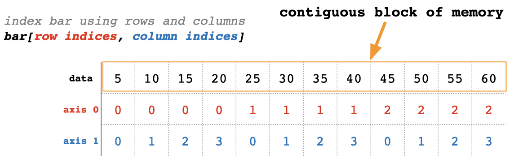
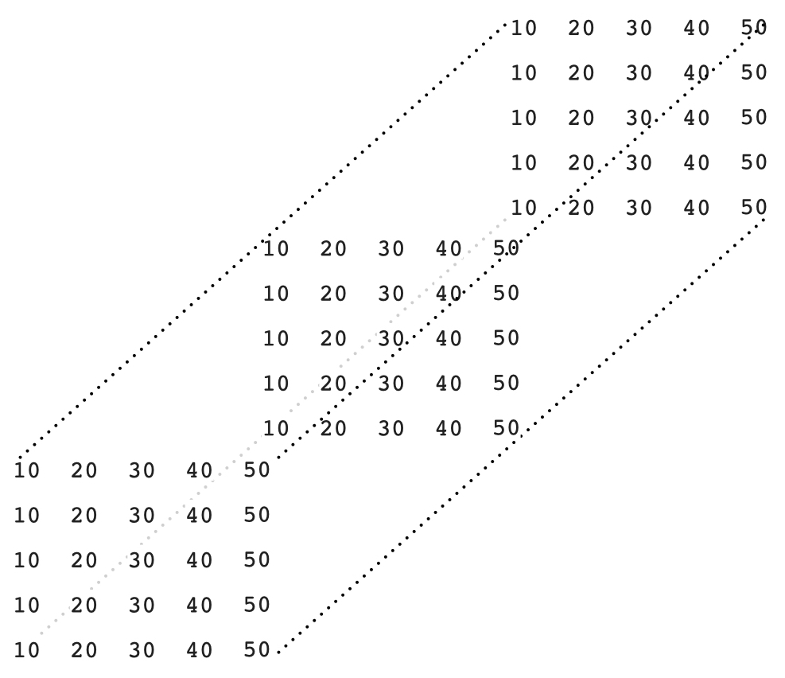
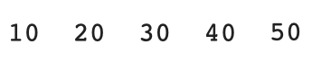
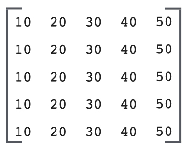
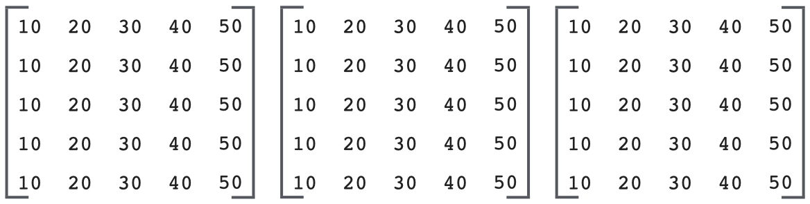
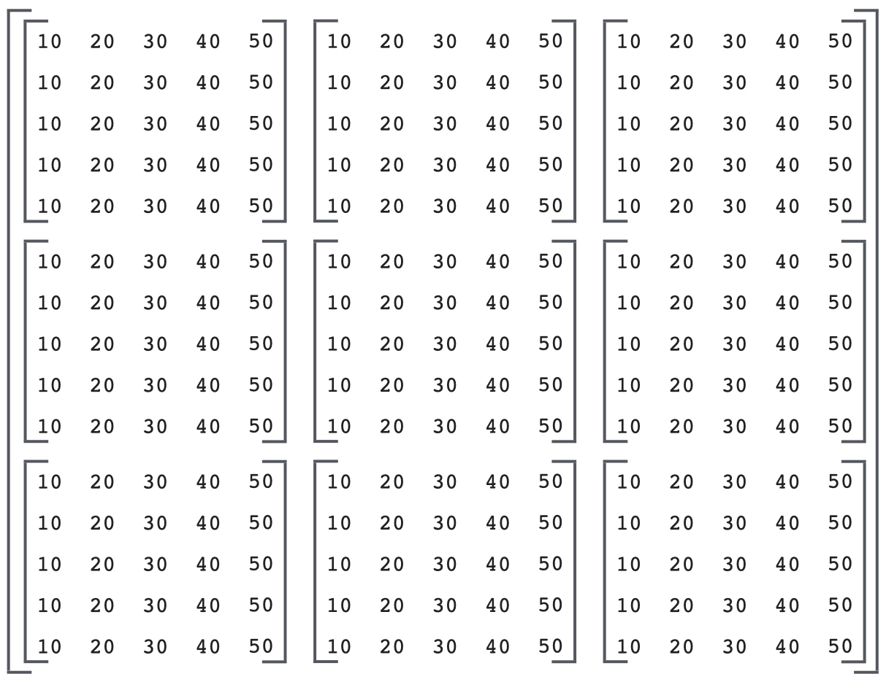

## Indexing Multidimensional Arrays

Start by making a new (3,4) array called bar from a list of lists.

```python
bar = np.array([
    [5, 10, 15, 20],
    [25, 30, 35, 40],
    [45, 50, 55, 60]
])
```

Internally, bar is just a contiguous block of memory storing some data. Since we defined bar using a list of lists, numpy makes it a two-dimensional array, giving it two axes for indexing its values.



Since bar has two axes (dimensions), numpy knows to interpret the data as a rectangular array where axis 0 is the row axis and axis 1 is the column axis. This means we can subset bar using a combination of row indices and column indices.

### Get element in the 2nd row, third column

```python
print(bar)
# [[ 5 10 15 20]
#  [25 30 35 40]
#  [45 50 55 60]]

print(bar[1, 2])
# 35
```

### Get first row as a 1-d array

```python
print(bar)
# [[ 5 10 15 20]
#  [25 30 35 40]
#  [45 50 55 60]]

print(bar[0])
# [ 5 10 15 20]
```

### Get first row as a 2-d array

```python
print(bar)
# [[ 5 10 15 20]
#  [25 30 35 40]
#  [45 50 55 60]]

print(bar[0, None])
# [[ 5 10 15 20]]
```

We’ll learn more about the None keyword later. Alternatively, you can use slicing for the row index.

```python
print(bar)
# [[ 5 10 15 20]
#  [25 30 35 40]
#  [45 50 55 60]]

print(bar[:1])
# [[ 5 10 15 20]]
```

### Get rows 2 & 3 with the 2nd-to-last and last columns

```python
print(bar)
# [[ 5 10 15 20]
#  [25 30 35 40]
#  [45 50 55 60]]

print(bar[1:3, [-2, -1]])
# [[35 40]
#  [55 60]]
```

### Modifying multiple elements

Replace the top left element of bar with -1

```python
print(bar)
# [[ 5 10 15 20]
#  [25 30 35 40]
#  [45 50 55 60]]

bar[0, 0] = -1
print(bar)
# [[-1 10 15 20]
#  [25 30 35 40]
#  [45 50 55 60]]
```

Replace the second row with the third row

```python
print(bar)
# [[ 5 10 15 20]
#  [25 30 35 40]
#  [45 50 55 60]]

bar[1] = bar[2]
print(bar)
# [[ 5 10 15 20]
#  [45 50 55 60]
#  [45 50 55 60]]
```

Insert zeros on diagonal

```python
print(bar)
# [[ 5 10 15 20]
#  [25 30 35 40]
#  [45 50 55 60]]

bar[[0, 1, 2], [0, 1, 2]] = [0, 0, 0]
print(bar)
# [[ 0 10 15 20]
#  [25  0 35 40]
#  [45 50  0 60]]
```

Notice here that the ith row index and the ith column index combine to **select a specific array element**. For example, row index 1 combines with column index 1 to select element bar[[1,1]] of bar.


## Interpreting Multidimensional Arrays

It's natural to interpret a three-dimensional array as a rectangular prism like this.



Unfortunately, this spacial model breaks down when you go above three dimensions. A better mental model is to interpret a 1-dimensional array as a row of numbers



a two-dimensional array as a matrix (rows and columns) 



a three-dimensional array as a row of matrices



a four-dimensional array as a matrix of matrices



and so on. Now if you have a three-dimensional array like this

```python
zoo = np.array([
    [
        [10,20],
        [30,40],
        [50,60],
    ],
    [
        [11,12],
        [13,14],
        [15,16],
    ]
])

print(zoo)
# [[[10 20]
#   [30 40]
#   [50 60]]
#  [[11 12]
#   [13 14]
#   [15 16]]]
```

and you make an assignment like zoo[0,:,1] = 5, you can interpret the assignment as

> :memo: set the 1st matrix, every row, 2nd column equal to 5

```python
zoo[0,:,1] = 5

print(zoo)
# [[[10  5]
#   [30  5]
#   [50  5]]
#  [[11 12]
#   [13 14]
#   [15 16]]]
```

> :warning: Attention<br>
We've glossed over some gritty details and complex scenarios regarding array indexing which we'll cover later.
