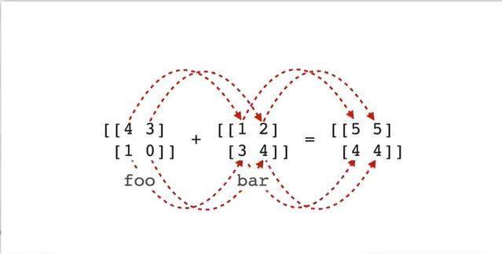

## Basic Math on Arrays

Start by defining a pair of 2x2 arrays, foo and bar.

```python
import numpy as np

foo = np.array([[4,3], [1,0]])
bar = np.array([[1,2], [3,4]])

print(foo)
# [[4 3]
#  [1 0]]

print(bar)
# [[1 2]
#  [3 4]]
```

## Addition

See what happens when we add foo + bar

```python
foo + bar
# array([[5, 5],
#        [4, 4]])
```
The values of foo and bar get added element wise<br>


## Subtraction

Element wise substraction

```python
foo - bar
# array([[ 3,  1],
#        [-2, -4]])
```

## Multiplication

Element wise multiplication

```python
foo * bar
# array([[4, 6],
#        [3, 0]])
```

## Division

Element wise division

```python
foo / bar
# array([[4.        , 1.5       ],
#        [0.33333333, 0.        ]])
```

## Matrix Multiplication

Use the @ operator to do matrix multiplication between numpy arrays.

```python
foo @ bar
# array([[13, 20],
#        [ 1,  2]])
```

## Broadcast Arithmetic

You can do the following, but in numpy you can do **foo + 5**
```python
foo + np.full(shape=(2,2), fill_value=5)
# array([[9, 8],
#        [6, 5]])
```

If you do foo + 5, numpy adds 5 to each element of foo.

```python
foo + bar
# array([[9, 8],
#        [6, 5]])
```

