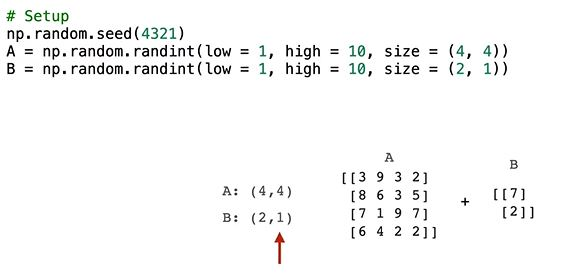
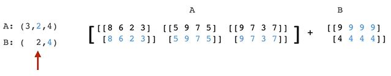

## Broadcasting

When we add a scalar to a 1-d array like this, the scalar gets added to each element of the array. 
```python
np.array([1,2,3]) + 0.5
# [1.5, 2.5, 3.5]
```


In essence, numpy is expanding the scalar into 3-element array and then does element-wise addition between the arrays. (NumPy doesn't actually do this because it'd be horribly inneficient, but in essence that's what's happening.) This is an example of [broadcasting](https://numpy.org/doc/stable/user/basics.broadcasting.html).

Broadcasting Rules (suppose we want to add two arrays, A and B ...):
- Moving backwards from the last dimension of each array, we check if their dimensions are compatible
- Dimensions are compatible if they are equal or either of them is one.
- If all of A's dimensions are compatible with B's dimensions, or vice versa, they are compatible arrays.

### Compatibility

Not every pair of arrays are compatible for broadcasting. Suppose we want to add two arrays, A and B..
- Moving backwards from the last dimension of each array,
  - We check if their dimensions are "compatible". Dimensions are compatible if they are equal or either of them is 1
  - If all of A's dimensions are compatible with B's dimensions, or vice versa, they are compatible arrays

### Examples

#### Example1


We start by comparing the last dimension of each array


Numpy can expand B


Then we have to compare the first dimension. Since they are equal they are compatible

```python
np.random.seed(1234)
A = np.random.randint(low = 1, high = 10, size = (3, 4))
B = np.random.randint(low = 1, high = 10, size = (3, 1))

print(A)
# [[4 7 6 5]
#  [9 2 8 7]
#  [9 1 6 1]]

print(B)
# [[7]
#  [3]
#  [1]]
```

A + B = ???

```python
A.shape  # (3, 4)
B.shape  # (3, 1)
##          ^  ^
##         compatible
```
Here, A is a 3x4 array and B is a 3x1 array. We start by comparing the last dimension of each array.
- Since the last dimension of A is length 4 and the last dimension of B is length 1, numpy can expand B by making 4 copies of it along its second axis. So, these dimensions are compatible.
- Now we have to compare the first dimension of A and B. Since they're both length 3, they’re compatible.

The only thing left for numpy is to carry out whatever procedure we wanted on two equivalently sized 3x4 arrays. (Remember, NumPy doesn't actually expand B like this because it'd be horribly inneficient.)

#### Example2




```python
np.random.seed(4321)
A = np.random.randint(low = 1, high = 10, size = (4, 4))
B = np.random.randint(low = 1, high = 10, size = (2, 1))

print(A)
# [[3 9 3 2]
#  [8 6 3 5]
#  [7 1 9 7]
#  [6 4 2 2]]

print(B)
# [[7]
#  [2]]
```

A + B = ???

```python
A.shape  # (4, 4)
B.shape  # (2, 1)
##          ^  ^
##         not compatible
```

Here, A is a 4x4 array and B is a 2x1 array.
- The last dimension of A is length 4 and the last dimension of B is length 1, so these dimensions are compatible. We can temporarily transform B by making 4 copies of it along its 2nd axis.
- Now we compare the 1st dimension of each array. In this case, there isn't an obvious way to expand B into a 4x4 array to match A or vice versa, so **these arrays are not compatible**.

#### Example3





```python
np.random.seed(1111)
A = np.random.randint(low = 1, high = 10, size = (3, 1, 4))
B = np.random.randint(low = 1, high = 10, size = (2, 1))

print(A)
# [[[8 6 2 3]]
#  [[5 9 7 5]]
#  [[9 7 3 7]]]

print(B)
# [[9]
#  [4]]
```

A + B = ???

```python
A.shape  # (3, 1, 4)
B.shape  # (   2, 1)
#           ^  ^  ^
#         compatible
```

Here, A is a 3x1x4 array and B is a 2x1 array.
- We start by comparing the last dimension of each array. In this case, A is length 4 and B is length 1, so we can expand B into a 2x4 array, making these dimensions compatible.
- Next, we compare the 2nd to last dimension of each array. In this case, A is length 1 and B is length 2. This time, we expand A, copying it twice along its second axis to match B.
- At this point, we're out of B dimensions, so we know A and B are compatible. To complete our mental model of how math between these arrays would work, we can imagine copying B 3 times along a newly added first dimension.
- We're left with two transformed arrays, each with shape 3x2x4, which we can easily add.
