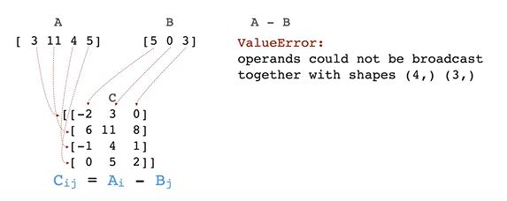
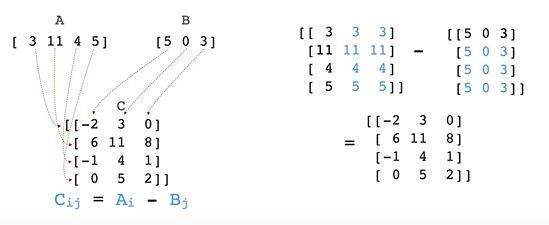
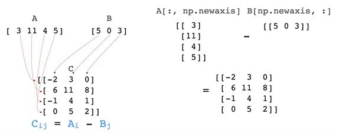
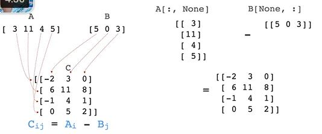

## newaxis

to increase the dimensionality of an array







with np.newaxis you can broadcast the arrays to make a substraction possible

with the none keyword



[np.newaxis](https://numpy.org/doc/stable/reference/constants.html#numpy.newaxis) allows us to promote the dimensionality of an array by giving it a new axis.

For example, suppose you have 1-d arrays A and B,
```python
A = np.array([3, 11, 4, 5])
B = np.array([5, 0, 3])
```
and your goal is to build a difference matrix where element (i,j) gives A<sub>i</sub> - B<sub>j</sub> . In other words, your goal is to subtract each element of B from each element of A.

If you do A - B, you'll get an error because the arrays don't have compatible shapes, and even if they were the same size, numpy would just do element-wise subtraction.

However, if A was a 4x1 array and B was 1x3 array, numpy would broadcast the arrays so that A - B produces the difference matrix we desire.

We can convert A from a (4,) array into a (4,1) array via 
```python
A[:, np.newaxis]
# array([[ 3],
#        [11],
#        [ 4],
#        [ 5]])
```

Similarly, we can convert B from a (3,) array into a (1,3) array via 
```python
B[np.newaxis, :]
# array([[5, 0, 3]])
```

Then we can calculate the difference matrix as 
```python
A[:, np.newaxis] - B[np.newaxis, :]
# array([[-2,  3,  0],
#        [ 6, 11,  8],
#        [-1,  4,  1],
#        [ 0,  5,  2]])
```

We can further simplify this to A[:, np.newaxis] - B since broadcasting rules will make B compatible with A[:, np.newaxis].

> :memo: newaxis is just an alias for None, so A[:, np.newaxis] - B is equivalent to A[:, None] - B.
