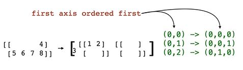

## reshape

You can use the [reshape()](https://numpy.org/doc/stable/reference/generated/numpy.reshape.html) function to change the shape of an array.

For example, 
```python
foo = np.arange(start=1, stop=9)
# [1 2 3 4 5 6 7 8]
```
We can reshape foo into a 2x4 array using either np.reshape()
```python
np.reshape(a=foo, newshape=(2,4))
# array([[1, 2, 3, 4],
#        [5, 6, 7, 8]])
```
or the reshape() method of the array object.
```python
foo.reshape(2,4)
# array([[1, 2, 3, 4],
#        [5, 6, 7, 8]])
```

These methods implement the same logic, just with slightly different interfaces.

> :memo: With foo.reshape(), we can pass in the new dimensions individually instead of as a tuple, but this comes at the expense of not being able to specify the newshape keyword.

```python
bar = foo.reshape(2,4)
print(bar)
[[1, 2, 3, 4]
 [5, 6, 7, 8]])
```
Now we want to reshape bar (2,4) in an (4,2)-array
```python
bar.reshape((4,2), order='C')
array([[1, 2],
       [3, 4],
       [5, 6],
       [7, 8]])
```


```python
bar.reshape((4,2), order='F')
array([[1, 3],
       [5, 7],
       [2, 4],
       [6, 8]])
```


Now we want to reshape bar (2,4) in an (2,2,2)-array
```python
bar.reshape((2,2,2), order='C')
array([[[1, 2],
        [3, 4]],
       [[5, 6],
        [7, 8]]])
```



```python
bar.reshape((2,2,2), order='F')
array([[[1, 3],
        [2, 4]],
       [[5, 7],
        [6, 8]]])
```


You can use -1 for one of the new shape dimensions (numpy will calculate it for you)
```python
bar.reshape(4,-1)
array([[1, 2],
       [3, 4],
       [5, 6],
       [7, 8]])
```

With reshape we only make a copy of the original array. If we want to modify the original we have to copy it.<br>
You can do this with
```python
bar = bar.reshape(4,2)
```
it makes an unnecessarly copy, a better solution is
```python
bar.shape = (4,2)
print(bar)
[[1, 2]
 [3, 4]
 [5, 6]
 [7, 8]]
```

### Array Transpose

You can also transpose an array using np.transpose() or the .T attribute of an array object.
```python
bar = np.array([[1,2,3,4], [5,6,7,8]])

print(bar)
# [[1 2 3 4]
#  [5 6 7 8]]

print(bar.T)
# [[1 5]
#  [2 6]
#  [3 7]
#  [4 8]]
```
```python
bar = np.array([[1,2,3,4], [5,6,7,8]])

print(bar)
# [[1 2 3 4]
#  [5 6 7 8]]

np.transpose(bar)
# [[1 5]
#  [2 6]
#  [3 7]
#  [4 8]]
```

In higher dimensions - if you have an (2,3,4,5)-Array you will get an (5,4,3,2)-Array
