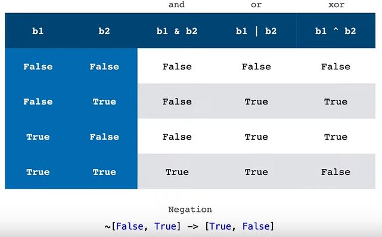

## Boolean Indexing

With boolean indexing, you can subset an array A using another array B of boolean values.

### Example 1

Suppose we have a 3x3 array, foo
```python
foo = np.array([
    [3, 9, 7],
    [2, 0, 3],
    [3, 3, 1]
])
```
and we set mask = foo == 3
```python
mask = foo == 3

print(mask)
# [[ True False False]
#  [False False  True]
#  [ True  True False]]
```
We can use mask to identify elements of foo which are equal to 3.
```python
print(foo[mask])
# [3 3 3 3]
```

Furthermore, we can use mask to convert 3s in foo to 0s. 
```python
foo[mask] = 0

print(foo)
# [[0 9 7]
#  [2 0 0]
#  [0 0 1]]
```

### Example 2

Just like integer arrays, we can use 1-d boolean arrays to pick out specific rows or columns of a 2-d array.

Consider this 3x3 array, foo
```python
foo = np.array([
    [3, 9, 7],
    [2, 0, 3],
    [3, 3, 1]
])
```
and these 1-d, length 3 boolean arrays r13 and c23. 
```python
r13 = np.array([True, False, True])
c23 = np.array([False, True, True])
```
We can use r13 to select rows 1 and 3 from foo. 
```python
print(foo[r13]) # like foo[[0,2]]
# [[3 9 7]
#  [3 3 1]]
```
We can use c23 to select rows 2 and 3 from foo. 
```python
print(foo[c23])
[[2 0 3]
 [3 3 1]]
```
We can use c23 to select columns 2 and 3 from foo. 
```python
print(foo[:, c23]) # like foo[:, [1,2]]
[[9 7]
 [0 3]
 [3 1]]
```

Observe what happens when we index foo with both r13 and c23. 
```python
# This is equivalent to foo[[0,2], [1,2]]
print(foo[r13, c23])
# [9 1]
```

NumPy treats boolean indices like integer indices, where the integers used are the indices of True elements. In other words, NumPy treats the boolean index array [True, False, True] just like the integer index array [0, 2] and it treats the boolean index array [False, True, True] just like the integer index array [1,2].

So, foo[r13, c23] is equivalent to foo[[0, 2], [1, 2]]. Recall that when you combine row and column index arrays in this way, NumPy uses corresponding indices from each index array to select elements from the target array - in this case, elements (0,1) and (2,2).

### Logical Operators

Logical operators let us combine boolean arrays. They include the "bitwise-and" operator, the "bitwise-or" operator, and the "bitwise-xor" operator.

```python
b1 = np.array([False, False, True, True])
b2 = np.array([False, True, False, True])

b1 & b2  # [False, False, False,  True], and
b1 | b2  # [False,  True,  True,  True], or
b1 ^ b2  # [False,  True,  True, False], xor
```

**Boolean Negation**

We can negate a boolean array by preceding it with a tilde ~.
```python
~np.array([False, True])
# array([ True, False])
```




### More Examples

```python
import numpy as np

names = np.array(["Dennis", "Dee", "Charlie", "Mac", "Frank"])
ages = np.array([43, 44, 43, 42, 74])
genders = np.array(['male', 'female', 'male', 'male', 'male'])
```
Who's at least 44?
```python
names[ages >= 44]

array(['Dee', 'Frank'], dtype='<U7')
```

Which males are over 42?
```python
names[(genders == 'male') & (ages > 42)]

array(['Dennis', 'Charlie', 'Frank'], dtype='<U7')
```

And who's a not a male or is younger than 43?
```python
names[~(genders == 'male') | (ages < 43)]

array(['Dee', 'Mac'], dtype='<U7')
```
