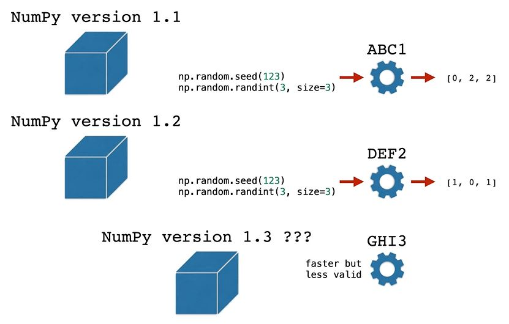
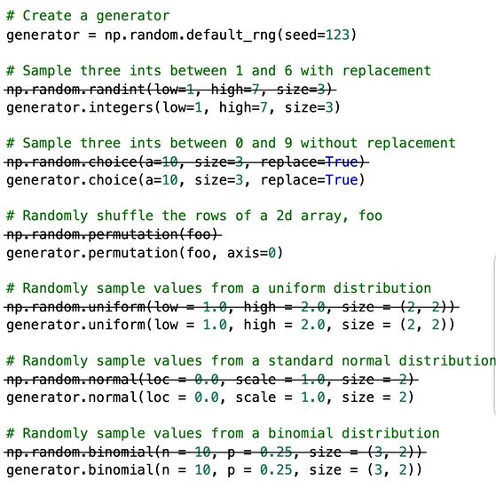

## random

You can use NumPy's [random module](https://numpy.org/doc/stable/reference/random/index.html#module-numpy.random) to shuffle arrays, sample values from arrays, and draw values from a host of probability distributions.

### Generators

Since Numpy version 1.17.0, it is recommended to use a Generator to produce random values rather than use the random module directly.

In most cases, the [default random number generator](https://numpy.org/doc/stable/reference/random/generator.html#numpy.random.default_rng) is sufficient.

Initialize default_rng without a seed
```python
rng = np.random.default_rng()
```

Initialize default_rng with a seed
```python
rng = np.random.default_rng(12345)
```

### Examples

#### Sample integers in range with replacement

Draw three integers from the range 1 to 6, with replacement. 
```python
generator = np.random.default_rng(seed=123)
generator.integers(low=1, high=7, size=3)
# array([1, 5, 4])
```

See [random.Generator.integers](https://numpy.org/doc/stable/reference/random/generated/numpy.random.Generator.integers.html)

#### Sample integers in range without replacement

Draw three integers from the range 0 to 9, without replacement.
```python
generator = np.random.default_rng(seed=123)
generator.choice(a=10, size=3, replace=False)
# array([5, 6, 0])
```

See [random.Generator.choice](https://numpy.org/doc/stable/reference/random/generated/numpy.random.Generator.choice.html#numpy.random.Generator.choice)

#### Randomly permute the rows of a 2-d array

Randomly shuffle the rows of this 5x2 array, foo
```python
foo = np.array([
    [1, 2],
    [3, 4],
    [5, 6],
    [7, 8],
    [9, 10]
])
generator = np.random.default_rng(seed=123)
generator.permutation(foo, axis=0)
# array([[ 9, 10],
#        [ 1,  2],
#        [ 5,  6],
#        [ 7,  8],
#        [ 3,  4]])
```

See [random.Generator.permutation](https://numpy.org/doc/stable/reference/random/generated/numpy.random.Generator.permutation.html)

#### Random sample from uniform distribution

Randomly sample four values between 1 and 2, then output as a 2x2 array. 
```python
generator = np.random.default_rng(seed=123)
generator.uniform(low=1.0, high=2.0, size=(2, 2))
# array([[1.68235186, 1.05382102],
#        [1.22035987, 1.18437181]])
```

See [random.Generator.uniform](https://numpy.org/doc/stable/reference/random/generated/numpy.random.Generator.uniform.html)

#### Random sample from normal distribution

Randomly sample two values from a standard normal distribution, then output as a length-2 1-d array. 
```python
generator = np.random.default_rng(seed=123)
generator.normal(loc=0.0, scale=1.0, size=2)
# array([-0.98912135, -0.36778665])
```

See [random.Generator.normal](https://numpy.org/doc/stable/reference/random/generated/numpy.random.Generator.normal.html)

#### Random sample from binomial distribution

Randomly sample six values from a binomial distribution with n=10 and p=0.25, then output as a 3x2 array.
```python
generator = np.random.default_rng(seed=123)
generator.binomial(n=10, p=0.25, size=(3, 2))
# array([[3, 0],
#        [1, 1],
#        [1, 4]])
```

See [random.Generator.binomial](https://numpy.org/doc/stable/reference/random/generated/numpy.random.Generator.binomial.html)

---

### Deprecated Examples

#### Sample integers in range with replacement

Draw three integers from the range 1 to 6, with replacement. 
```python
import numpy as np

np.random.randint(low=1, high=7, size=3)
# array([1, 5, 4])
```

See [random.randint](https://numpy.org/doc/stable/reference/random/generated/numpy.random.randint.html)

To get reproduceable values you have to set the seed function.
```python
import numpy as np

np.random.seed(123)
np.random.randint(low=1, high=7, size=3)
# array([6, 3, 5])
```

#### Sample integers in range without replacement

```python
import numpy as np

np.random.seed(123)
np.random.choice(
  a = np.arange(1,7),  # [1,2,3,4,5,6]
  size = 3,
  replace = False,
  p = None
)

# array([6, 5, 1])
```

See [random.choice](https://numpy.org/doc/stable/reference/random/generated/numpy.random.choice.html)

With a probabilty to each element
```python
import numpy as np

np.random.seed(123)
np.random.choice(
  a = np.arange(1,7),  # [1,2,3,4,5,6]
  size = 3,
  replace = False,
  p = np.array([0.1, 0.1, 0.1, 0.1, 0.3, 0.3])
)

# array([5, 2, 6])
```

With strings
```python
import numpy as np

np.random.seed(123)
np.random.choice(
  a = np.array(['you', 'can', 'use', 'strings', 'too']),
  size = 3,
  replace = False,
  p = None
)

# array(['use', 'you', 'can'], dtype='<U7')
```

#### Randomly permute the rows of a 2-d array

Randomly shuffle the rows of this 5x2 array, foo
```python
foo = np.array([
    [1, 2],
    [3, 4],
    [5, 6],
    [7, 8],
    [9, 10]
])
np.random.seed(1234)
rand_rows = np.random.randint(
  low = 0,
  high = foo.shape[0],
  size = 3
)

print(rand_rows)
[3 4 4]

foo[rand_rows]
array([[7, 8],
       [9, 10 ],
       [9, 10]])
```

Without replacement
```python
foo = np.array([
    [1, 2],
    [3, 4],
    [5, 6],
    [7, 8],
    [9, 10]
])
np.random.seed(1234)
rand_rows = np.random.choice(
  a = np.arange[start=0, stop=foo.shape[0]),
  replace = False,
  size = 3
)

print(rand_rows)
[4 0 1]

foo[rand_rows]
array([[9, 10],
       [1, 2],
       [3, 4]])
```

#### Randomly permute the rows of a 2-d array

Randomly shuffle the rows of this 5x2 array, foo
```python
np.random.permutation(foo)

array([[7, 8],
       [5, 6],
       [3, 4],
       [1, 2],
       [9, 10]])
```

See [random.permutation](https://numpy.org/doc/stable/reference/random/generated/numpy.random.permutation.html)

#### Random sample from uniform distribution

Randomly sample four values between 1 and 2, then output as a 2x2 array. 
```python
np.random.uniform(low = 1.0, high = 2.0, size = (2,2))

# array([[1.68235186, 1.05382102],
#        [1.22035987, 1.18437181]])
```

See [random.uniform](https://numpy.org/doc/stable/reference/random/generated/numpy.random.uniform.html)

#### Random sample from normal distribution

Randomly sample two values from a standard normal distribution, then output as a length-2 1-d array. 
```python
np.random.normal(loc = 0.0, scale = 1.0, size = 2)

# array([-0.98912135, -0.36778665])
```

See [random.normal](https://numpy.org/doc/stable/reference/random/generated/numpy.random.normal.html)

#### Random sample from binomial distribution

Randomly sample six values from a binomial distribution with n=10 and p=0.25, then output as a 3x2 array.
```python
np.random.binomial(n = 10, p = 0.25, size = (3, 2))
# array([[3, 0],
#        [1, 1],
#        [1, 4]])
```

See [random.binomial](https://numpy.org/doc/stable/reference/random/generated/numpy.random.binomial.html)

#### Why deprecated

There are different number generators (ABC1, DEF2, GHI3) in different versions



The solution was to create a generic generator class [numpy.random.default_rng()](https://numpy.org/doc/stable/reference/random/generator.html)

Currently the default random generator is **PCG64**

#### Steps to change



