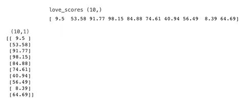
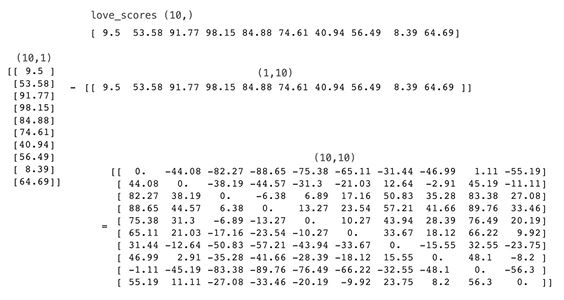
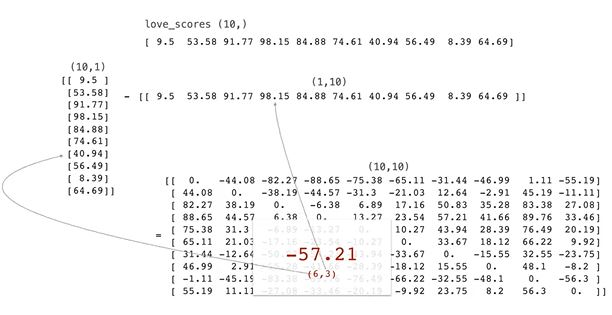

## Love Distance Problem

### Setup

You’re a relationship scientist, and you’ve developed a questionnaire that determines a person’s love score - a real-valued number between 0 and 100. Your theory is that two people with similar love scores should make a good match

Given the love scores for 10 different people, create a 2-d array where (i,j) gives the absolute difference of the love scores for person i and person j.

```python
import numpy as np

generator = np.random.default_rng(1010)
love_scores = np.round(generator.uniform(low=0, high=100, size=10), 2)

print(love_scores)
# [ 9.5  53.58 91.77 98.15 84.88 74.61 40.94 56.49  8.39 64.69]
```

### Solution
```python
np.abs(love_scores[:, None] - love_scores[None, :])

array([[ 0.  , 44.08, 82.27, 88.65, 75.38, 65.11, 31.44, 46.99,  1.11,
        55.19],
       [44.08,  0.  , 38.19, 44.57, 31.3 , 21.03, 12.64,  2.91, 45.19,
        11.11],
       [82.27, 38.19,  0.  ,  6.38,  6.89, 17.16, 50.83, 35.28, 83.38,
        27.08],
       [88.65, 44.57,  6.38,  0.  , 13.27, 23.54, 57.21, 41.66, 89.76,
        33.46],
       [75.38, 31.3 ,  6.89, 13.27,  0.  , 10.27, 43.94, 28.39, 76.49,
        20.19],
       [65.11, 21.03, 17.16, 23.54, 10.27,  0.  , 33.67, 18.12, 66.22,
         9.92],
       [31.44, 12.64, 50.83, 57.21, 43.94, 33.67,  0.  , 15.55, 32.55,
        23.75],
       [46.99,  2.91, 35.28, 41.66, 28.39, 18.12, 15.55,  0.  , 48.1 ,
         8.2 ],
       [ 1.11, 45.19, 83.38, 89.76, 76.49, 66.22, 32.55, 48.1 ,  0.  ,
        56.3 ],
       [55.19, 11.11, 27.08, 33.46, 20.19,  9.92, 23.75,  8.2 , 56.3 ,
         0.  ]])
```
```python
np.set_printoptions(linewidth=999)
np.abs(love_scores[:, None] - love_scores[None, :])

array([[ 0.  , 44.08, 82.27, 88.65, 75.38, 65.11, 31.44, 46.99,  1.11, 55.19],
       [44.08,  0.  , 38.19, 44.57, 31.3 , 21.03, 12.64,  2.91, 45.19, 11.11],
       [82.27, 38.19,  0.  ,  6.38,  6.89, 17.16, 50.83, 35.28, 83.38, 27.08],
       [88.65, 44.57,  6.38,  0.  , 13.27, 23.54, 57.21, 41.66, 89.76, 33.46],
       [75.38, 31.3 ,  6.89, 13.27,  0.  , 10.27, 43.94, 28.39, 76.49, 20.19],
       [65.11, 21.03, 17.16, 23.54, 10.27,  0.  , 33.67, 18.12, 66.22,  9.92],
       [31.44, 12.64, 50.83, 57.21, 43.94, 33.67,  0.  , 15.55, 32.55, 23.75],
       [46.99,  2.91, 35.28, 41.66, 28.39, 18.12, 15.55,  0.  , 48.1 ,  8.2 ],
       [ 1.11, 45.19, 83.38, 89.76, 76.49, 66.22, 32.55, 48.1 ,  0.  , 56.3 ],
       [55.19, 11.11, 27.08, 33.46, 20.19,  9.92, 23.75,  8.2 , 56.3 ,  0.  ]])
```

### Explanation

The trick of this solution is broadcasting







```python
love_scores[:, None]

array([[ 9.5 ],
       [53.58],
       [91.77],
       [98.15],
       [84.88],
       [74.61],
       [40.94],
       [56.49],
       [ 8.39],
       [64.69]])
```

```python
love_scores[None, :]

array([[ 9.5 , 53.58, 91.77, 98.15, 84.88, 74.61, 40.94, 56.49,  8.39, 64.69]])
```

```python
np.abs(love_scores[:, None] - love_scores[None, :])
#np.abs(love_scores[:, None] - love_scores)

array([[ 0.  , 44.08, 82.27, 88.65, 75.38, 65.11, 31.44, 46.99,  1.11, 55.19],
       [44.08,  0.  , 38.19, 44.57, 31.3 , 21.03, 12.64,  2.91, 45.19, 11.11],
       [82.27, 38.19,  0.  ,  6.38,  6.89, 17.16, 50.83, 35.28, 83.38, 27.08],
       [88.65, 44.57,  6.38,  0.  , 13.27, 23.54, 57.21, 41.66, 89.76, 33.46],
       [75.38, 31.3 ,  6.89, 13.27,  0.  , 10.27, 43.94, 28.39, 76.49, 20.19],
       [65.11, 21.03, 17.16, 23.54, 10.27,  0.  , 33.67, 18.12, 66.22,  9.92],
       [31.44, 12.64, 50.83, 57.21, 43.94, 33.67,  0.  , 15.55, 32.55, 23.75],
       [46.99,  2.91, 35.28, 41.66, 28.39, 18.12, 15.55,  0.  , 48.1 ,  8.2 ],
       [ 1.11, 45.19, 83.38, 89.76, 76.49, 66.22, 32.55, 48.1 ,  0.  , 56.3 ],
       [55.19, 11.11, 27.08, 33.46, 20.19,  9.92, 23.75,  8.2 , 56.3 ,  0.  ]])
```
