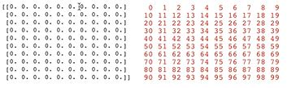
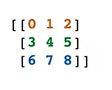
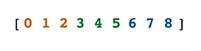

## Psycho Parent

### Setup

Eager to make your mark on the PTA, you decide the best way to hide eggs for the upcoming Easter egg hunt is to use NumPy. You represent the field as a 10x10 array of 0s.

```python
import numpy as np

field = np.zeros(shape = (10, 10))

print(field)
# [[0. 0. 0. 0. 0. 0. 0. 0. 0. 0.]
#  [0. 0. 0. 0. 0. 0. 0. 0. 0. 0.]
#  [0. 0. 0. 0. 0. 0. 0. 0. 0. 0.]
#  [0. 0. 0. 0. 0. 0. 0. 0. 0. 0.]
#  [0. 0. 0. 0. 0. 0. 0. 0. 0. 0.]
#  [0. 0. 0. 0. 0. 0. 0. 0. 0. 0.]
#  [0. 0. 0. 0. 0. 0. 0. 0. 0. 0.]
#  [0. 0. 0. 0. 0. 0. 0. 0. 0. 0.]
#  [0. 0. 0. 0. 0. 0. 0. 0. 0. 0.]
#  [0. 0. 0. 0. 0. 0. 0. 0. 0. 0.]]
```

Insert 20 random normal values at random (non repeating) locations in the grid. Then you'll know how much candy to hide at each spot.

### Solution

```python
import numpy as np

np.set_printoptions(linewidth=999)
generator = np.random.default_rng(1234)
vals = np.round(generator.normal(size = 20), 2)
locs = generator.choice(field.size, len(vals), replace = False)
field.ravel()[locs] = vals
print(field)
```

### Explanation

We need to fill 20 eggs based on a normal distribution

To get 20 normal values
```python
generator = np.random.default_rng(1234)
generator.normal(size = 20)

array([-1.60383681,  0.06409991,  0.7408913 ,  0.15261919,  0.86374389,  2.91309922, -1.47882336,  0.94547297, -1.66613546,  0.34374458, -0.51244371,  1.32375896, -0.86028019,  0.5194932 , -1.26514372, -2.15913901,  0.43473395,  1.73328932,  0.52013416, -1.00216579])
```

To round that values and put it to a variable
```python
generator = np.random.default_rng(1234)
vals = np.round(generator.normal(size = 20), 2)
print(vals)

[-1.6   0.06  0.74  0.15  0.86  2.91 -1.48  0.95 -1.67  0.34 -0.51  1.32 -0.86  0.52 -1.27 -2.16  0.43  1.73  0.52 -1.  ]
```

The hard part of the task is to put these 20 values to unique fields of the field array

A unique value of the field array could be 0,1,2,3, ... ,99



The goal is to randomise 20 values inside these 99 values

```python
generator = np.random.default_rng(1234)
vals = np.round(generator.normal(size = 20), 2)
print(vals)

[-1.6   0.06  0.74  0.15  0.86  2.91 -1.48  0.95 -1.67  0.34 -0.51  1.32 -0.86  0.52 -1.27 -2.16  0.43  1.73  0.52 -1.  ]
```

We need 20 values between 0 an 99 without replacement (we can use the choice function)
```python
# locs = generator.choice(100, 20, replace = False)
locs = generator.choice(field.size, len(vals), replace = False)
print(locs)

[15 99 42 55 41  5  3 86 39 35 61 46 63 48 11 84 24 17  0 51]
```

Now we have to put vals in the locs (we can use the [numpy.ravel](https://numpy.org/doc/stable/reference/generated/numpy.ravel.html) function)

Ravel takes a multidimensional array like



and transforms it in an array like



```python
field.ravel()

array([0., 0., 0., 0., 0., 0., 0., 0., 0., 0., 0., 0., 0., 0., 0., 0., 0., 0., 0., 0., 0., 0., 0., 0., 0., 0., 0., 0., 0., 0., 0., 0., 0., 0., 0., 0., 0., 0., 0., 0., 0., 0., 0., 0., 0., 0., 0., 0., 0., 0., 0., 0., 0., 0., 0., 0., 0., 0., 0., 0., 0., 0., 0., 0., 0., 0., 0., 0., 0., 0., 0., 0., 0., 0., 0., 0., 0., 0., 0., 0., 0., 0., 0., 0., 0., 0., 0., 0., 0., 0., 0., 0., 0., 0., 0., 0., 0., 0., 0., 0.])
```

Now we can change values in this array
```python
field.ravel()[locs] = vals
print(field)

[[ 0.52  0.    0.   -1.48  0.    2.91  0.    0.    0.    0.  ]
 [ 0.   -1.27  0.    0.    0.   -1.6   0.    1.73  0.    0.  ]
 [ 0.    0.    0.    0.    0.43  0.    0.    0.    0.    0.  ]
 [ 0.    0.    0.    0.    0.    0.34  0.    0.    0.   -1.67]
 [ 0.    0.86  0.74  0.    0.    0.    1.32  0.    0.52  0.  ]
 [ 0.   -1.    0.    0.    0.    0.15  0.    0.    0.    0.  ]
 [ 0.   -0.51  0.   -0.86  0.    0.    0.    0.    0.    0.  ]
 [ 0.    0.    0.    0.    0.    0.    0.    0.    0.    0.  ]
 [ 0.    0.    0.    0.   -2.16  0.    0.95  0.    0.    0.  ]
 [ 0.    0.    0.    0.    0.    0.    0.    0.    0.    0.06]]
```
