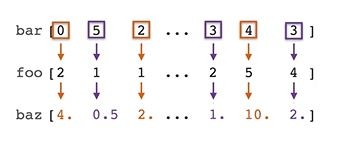
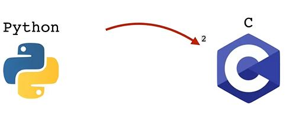
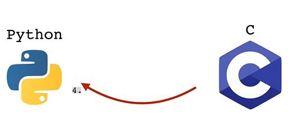
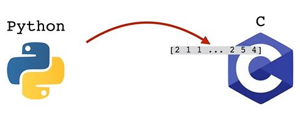
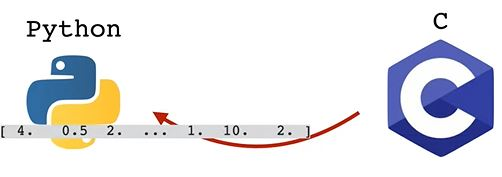

## where() Function

You can use NumPy's [where()](https://numpy.org/doc/stable/reference/generated/numpy.where.html) function as a vectorized form of "if array element meets condition, then x else y".

Suppose you have two arrays (foo and bar) and a third array baz. With even values in bar the baz value
will become 2 times the value of foo and with odd values in bar the baz value will become half form foo.



You can do this with an for-loop
```python
import numpy as np

# Make a random number generator
generator = np.random.default_rng()

# Sample 1M integers between 0 and 5
foo = generator.integers(6, size=2*10**6)
print(foo)

# [0 2 1 ... 1 1 1]

# Sample 1M integers between 0 and 5
bar = generator.integers(6, size=2*10**6)
print(bar)

# [4 0 3 ... 5 1 5]

baz = np.zeros(foo.size)
for i in range(foo.size):
  if bar[i] % 2 == 0:
    baz[i] = foo[i] * 2
  else:
    baz[i] = foo[i] / 2

print(baz)

# [0.  4.  0.5 ... 0.5 0.5 0.5]
```

This technique takes a while to execute. The slowdown happens because for every iteration of the loop python
has to call some lower-level function in C





Numpy is spezificly designed to address this problem. Python gives the whole array to C and C gives back the whole result array. This is called factorization





We can solve this problem with the where-function
```python
boz = np.where(bar % 2 == 0, foo * 2, foo / 2)
print(boz)

# [0.  4.  0.5 ... 0.5 0.5 0.5]

np.array_equal(baz, boz)

# True
```

Use the %%timeit function to measure the time
```python
%%timeit
boz = np.where(bar % 2 == 0, foo * 2, foo / 2)
print(boz)
```

---

For example, given a 2-d array foo

```python
foo = np.array([
    [1,2,3],
    [4,5,6]
])
```

We can create a corresponding array bar which displays "cat" where foo is even and "dog" where foo is odd.

```python
np.where(foo % 2 == 0, 'cat', 'dog')
array([['dog', 'cat', 'dog'],
       ['cat', 'dog', 'cat']], dtype='<U3')
```
