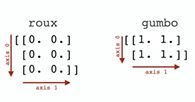

## concatenate()

You can use the [concatenate()](https://numpy.org/doc/stable/reference/generated/numpy.concatenate.html) function to combine two or more arrays.

```python
roux = np.zeros(shape = (3,2))
print(roux)
[[0. 0.]
 [0. 0.]
 [0. 0.]]

gumbo = np.ones(shape = (2,2))
print(gumbo)
[[1. 1.]
 [1. 1.]]
```

Concatenate roux with a couple copies of itself row-wise.



```python
np.concatenate((roux, roux, roux), axis=0)
# array([[0., 0.],
#        [0., 0.],
#        [0., 0.],
#        [0., 0.],
#        [0., 0.],
#        [0., 0.],
#        [0., 0.],
#        [0., 0.],
#        [0., 0.]])
```

Concatenate roux with a couple copies of itself column-wise.
```python
np.concatenate((roux, roux, roux), axis=1)
# array([[0., 0., 0., 0., 0., 0.],
#        [0., 0., 0., 0., 0., 0.],
#        [0., 0., 0., 0., 0., 0.]])
```

Concatenate roux and gumbo row-wise.
```python
np.concatenate((roux, gumbo), axis=0)
# array([[0., 0.],
#        [0., 0.],
#        [0., 0.],
#        [1., 1.],
#        [1., 1.]])
```

When you concatenate arrays, they must have the same exact shape excluding the axis along which you’re concatenating. For example, if we try to concatenate roux and gumbo column-wise, NumPy throws an error.
```python
np.concatenate((roux, gumbo), axis = 1)
# ValueError: 
ValueError: all the input array dimensions for the concatenation axis must match exactly, but along dimension 0, the array at index 0 has size 3 and the array at index 1 has size 2
```

