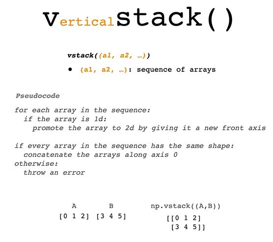
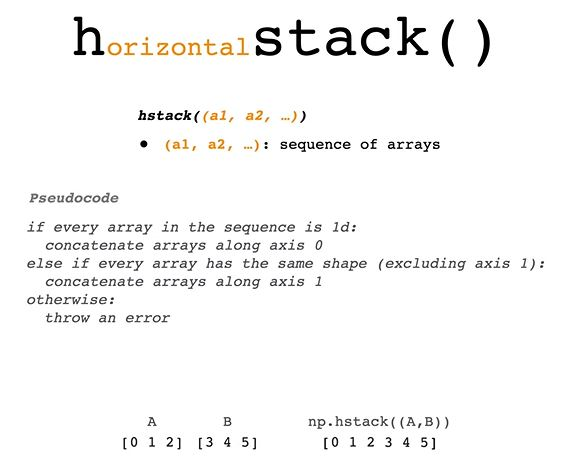
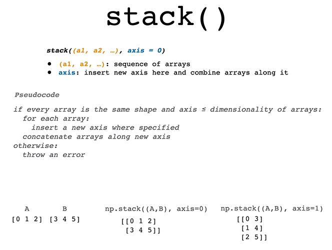

## Stacking

You can use [vstack()](https://numpy.org/doc/stable/reference/generated/numpy.vstack.html), [hstack()](https://numpy.org/doc/stable/reference/generated/numpy.hstack.html), and [stack()](https://numpy.org/doc/stable/reference/generated/numpy.stack.html) to combine arrays.

### vstack()

vstack() takes one argument - a sequence of arrays. You could describe its algorithm in pseudocode as

```python
for each array in the sequence:
  if the array is 1-d:
    promote the array to 2-d by giving it a new front axis
  if every array has the same shape:
    concatenate the arrays along axis 0
  else:
    throw an error
```



Visually, you could imagine vstack() as vertically stacking 1-d or 2-d arrays.

Examples:
```python
foo = np.array(['a', 'b'])
bar = np.array(['c', 'd'])
baz = np.array([['e', 'f']])
bingo = np.array([['g', 'h', 'i']])
```
```python
np.vstack((foo, bar))
# [['a' 'b']
#  ['c' 'd']]
```
```python
np.vstack((foo, bar, baz))
# [['a' 'b']
#  ['c' 'd']
#  ['e' 'f']]
```
```python
np.vstack((baz, bingo))
# ValueError:
ValueError: all the input array dimensions for the concatenation axis must match exactly, but along dimension 1, the array at index 0 has size 2 and the array at index 1 has size 3
```

### hstack()

hstack() takes one argument - a sequence of arrays. You could describe its algorithm in pseudocode as

```python
if every array in the sequence is 1-d:
  concatenate the arrays along axis 0
else:
  if every array has the same shape excluding axis 1:
    concatenate arrays along axis 1
  else:
    throw an error
```



Visually, you could imagine hstack() as horizontally stacking 1-d or 2-d arrays.

Examples:

```python
foo = np.array(['a', 'b'])
bar = np.array(['c', 'd'])
baz = np.array([['e', 'f']])
bingo = np.array([['g', 'h', 'i']])
bongo = np.array(
    [['j', 'k'],
     ['l', 'm']]
)
```

```python
np.hstack((foo, bar))
# ['a' 'b' 'c' 'd']
```

```python
np.hstack((baz, bingo))
# [['e' 'f' 'g' 'h' 'i']]
```

```python
np.hstack((foo, bingo))
# ValueError:
ValueError: all the input arrays must have same number of dimensions, but the array at index 0 has 1 dimension(s) and the array at index 1 has 2 dimension(s)
```

```python
np.hstack((bingo, bongo))
# ValueError:
ValueError: all the input array dimensions for the concatenation axis must match exactly, but along dimension 0, the array at index 0 has size 1 and the array at index 1 has size 2
```

### stack()

stack() takes two arguments:

- a sequence of arrays to combine
- axis which tells stack() to create a new axis along which to combine the arrays.

You could describe its algorithm in pseudocode as
```python
if every array is the same shape and axis is less than or equal to the dimensionality of the arrays:
  for each array:
    insert a new axis where specified
  concatenate the arrays along the new axis
else:
  throw an error.
```



Examples:

```python
foo = np.array(['a', 'b'])
bar = np.array(['c', 'd'])
```

```python
# np.stack((foo, bar), axis=0)
# array([['a', 'b'],
#        ['c', 'd']], dtype='<U1')
```

```python
np.stack((foo, bar), axis=1)
# array([['a', 'c'],
#        ['b', 'd']], dtype='<U1')
```

```python
np.stack((foo, bar), axis=2)
# numpy.AxisError:
numpy.AxisError: axis 2 is out of bounds for array of dimension 2
```

```python
np.stack((foo, bar), axis=-1)
# array([['a', 'c'],
#        ['b', 'd']], dtype='<U1')
```
