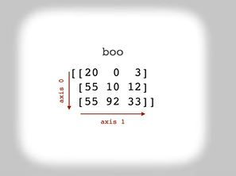
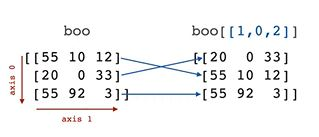
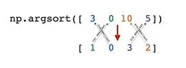
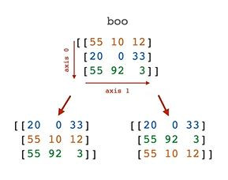

## Sorting

You can use numpy’s [sort()](https://numpy.org/doc/stable/reference/generated/numpy.sort.html) function to sort the elements of an array.

sort() takes three primary parameters:
- a: the array you want to sort
- axis: the axis along which to sort. (The default, -1, sorts along the last axis.)
- kind: the kind of sort you want numpy to implement. By default, numpy implements quicksort.

For example, here we make a 1-d array, foo, and then sort it in ascending order.
```python
foo = np.array([1, 7, 3, 9, 0, 9, 1])
np.sort(foo)
# array([0, 1, 1, 3, 7, 9, 9])
```

Note that the original array remains unchanged.
```python
foo
# array([1, 7, 3, 9, 0, 9, 1])
```

If you want to sort the values of foo in place, use the sort method of the array object.
```python
foo.sort()
foo
# array([0, 1, 1, 3, 7, 9, 9])
```

### Sort with NaN

If you have an array with NaN values, sort() pushes them to the end of the array. 
```python
bar = np.array([5, np.nan, 3, 11])
np.sort(bar)
# array([ 3.,  5., 11., nan])
```

### Sort In Descending Order (Reverse Sort)

Unfortunately NumPy doesn't have a direct way of sorting arrays in descending order. However, there are multiple ways to accomplish this.

- Sort the array in ascending order and then reverse the result.
  ```python
  bar = np.array([5, np.nan, 3, 11])
  np.sort(bar)[::-1]
  # array([nan, 11.,  5.,  3.])
  ```
- Negate the array’s values, sort those in ascending order, and then negate that result.
  ```python
  bar = np.array([5, np.nan, 3, 11])
  -np.sort(-bar)
  # array([11.,  5.,  3., nan])
  ```

The main difference between these techniques is that the first method pushes NaNs to the front of the array and the second method pushes NaNs to the back. Also, the second method won’t work on strings since you can’t negate a string.

### Sorting A Multidimensional Array

What if you wanted to sort a multidimensional array like this?

```python
boo = np.array([
    [55, 10, 12],
    [20, 0, 33],
    [55, 92, 3]
])
```

In this case, you can use the axis parameter of the sort() function to specify which axis to sort along. 



#### Sort each column of a 2-d array

```python
np.sort(boo, axis=0) # sort along the row axis
# array([[20,  0,  3],
#        [55, 10, 12],
#        [55, 92, 33]])
```

#### Sort each row of a 2-d array

```python
np.sort(boo, axis=1) # sort along the column axis
# array([[10, 12, 55],
#        [ 0, 20, 33],
#        [ 3, 55, 92]])
```

#### Sort the last axis of an array

```python
np.sort(boo, axis=-1) # sort along the last axis 
                      # Since boo is a 2-d array, the last axis, 1, is the column axis. Thus np.sort(boo, axis=-1) is equivalent to np.sort(boo, axis=1).

# array([[10, 12, 55],
#        [ 0, 20, 33],
#        [ 3, 55, 92]])
```

> :memo: When we talk about sorting along an axis, each element's position in the array remains fixed except for that axis. For example, observe the 20 in boo. When we sort along the row axis (axis 0), only its row coordinate changes (from (1,0) to (0,0)). When we sort along the column axis (axis 1), only its column coordinate changes (from (1,0) to (1,1)). That's why sorting along axis 0 does column sorts in a 2-d array and sorting along axis 1 does row sorts in a 2-d array.


### argsort()



[argsort()](https://numpy.org/doc/stable/reference/generated/numpy.argsort.html) works just like sort(), except it returns an array of indices indicating the position each value of the array would map to in the sorted case.



Example
```python
foo = np.array([3, 0, 10, 5])
np.argsort(foo)
# array([1, 0, 3, 2])
```

Here, argsort() tells us:
- the smallest element of foo is at position 1
- the second smallest element of foo is at position 0
- the third smallest element of foo is at position 3
- the fourth smallest element of foo is at position 2

If you used this array to index the original array, you’d get its sorted form (just as if you had called np.sort (foo)).

```python
foo = np.array([3, 0, 10, 5])
idx = np.argsort(foo)
foo[idx]
# array([ 0,  3,  5, 10])
```

#### Sort the rows of a 2-d array according to its first column

```python
boo = np.array([
    [55, 10, 12],
    [20, 0, 33],
    [55, 92, 3]
])
```



If you want to reorder the rows of boo according to the values in its first column, you can plug in the index array [1, 0, 2].

```python
idx = np.array([1, 0, 2])
boo[idx]
# array([[20,  0, 33],
#        [55, 10, 12],
#        [55, 92,  3]])
```

To create the index array dynamically, simply call argsort() on the first column of boo.

```python
idx = np.argsort(boo[:, 0])
print(idx)
# [1 0 2]

boo[idx]
# array([[20,  0, 33],
#        [55, 10, 12],
#        [55, 92,  3]])
```

### Stable Sorting

The previous example raises an important question. If an array has repeated values, how do we guarantee that sorting them won't alter the order they appear in the original array? For example, given boo

```python
boo = np.array([
    [55, 10, 12],
    [20, 0, 33],
    [55, 92, 3]
])
```

this

```python
boo[[1, 0, 2]]
# array([[20,  0, 33],
#        [55, 10, 12],
#        [55, 92,  3]])
```

and this

```python
boo[[1, 2, 0]]
# array([[20,  0, 33],
#        [55, 92,  3],
#        [55, 10, 12]])
```

are both valid sorts of boo along its first column, but only the first array retains the original order of the rows beginning with 55. This is known as a [stable sorting algorithm](https://en.wikipedia.org/wiki/Sorting_algorithm#Stability). By default, np.sort() and np.argsort() don't use a stable sorting algorithm. If you'd like to use a stable sort, set the kind parameter equal to 'stable'.

```python
boo[np.argsort(boo[:, 0], kind='stable')]
# array([[55, 10, 12],
#        [20,  0, 33],
#        [55, 92,  3]])
```
