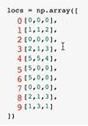
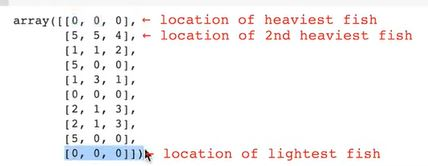

## Big Fisch

### Setup

10 fish occupy a 5x5x5 grid of water. Each fish decides to move to a new (i,j,k) location given by the 2-d array below. If multiple fish end up occupying the same cell, the biggest fish eats the smaller fish. Determine which fish survive.

```python
import numpy as np

locs = np.array([
    [0,0,0],
    [1,1,2],
    [0,0,0],
    [2,1,3],
    [5,5,4],
    [5,0,0],
    [5,0,0],
    [0,0,0],
    [2,1,3],
    [1,3,1]
])

generator = np.random.default_rng(1010)
weights = generator.normal(size=10)

print(weights)
[-1.69870017  0.53799701 -0.22561399 -1.09020894  0.55391264 -1.50115445  0.44545933  1.3448172  -1.12364327  0.21216015]
# [-1.699  0.538 -0.226 -1.09   0.554 -1.501  0.445  1.345 -1.124  0.212]
```

> :memo: Use np.set_printoptions(precision=3) to show values with just three decimal places.

### Solution

```python
sorted_fish = np.argsort(weights)[::-1]
uniques, first_idxs = np.unique(locs[sorted_fish], axis = 0, return_index = True)
survivors = sorted_fish[first_idxs]
print(survivors)
```

### Explanation

We assign an id to each fish (0 ... 9)



```python
np.argsort(weights)

array([0, 5, 8, 3, 2, 9, 6, 1, 4, 7], dtype=int64)
```

We reverse this sorted list (from heaviest to lightest) an put it to the variable sorted_fish
```python
sorted_fish = np.argsort(weights)[::-1]

print(sorted_fish)

[7 4 1 6 9 2 3 8 5 0]
```

We index the locs-array with sorted_fish to reorder the locs-array
```python
locs[sorted_fish]

array([[0, 0, 0],
       [5, 5, 4],
       [1, 1, 2],
       [5, 0, 0],
       [1, 3, 1],
       [0, 0, 0],
       [2, 1, 3],
       [2, 1, 3],
       [5, 0, 0],
       [0, 0, 0]])
```



Look at the duplicate locations like [0, 0, 0] at index 0, 5 and 9. The fish which survive is at index 0, because it is the heaviest fish. Therefore we need the unique value of the first occurence of the fish. We can do that with the unique-function
```python
uniques, first_idxs = np.unique(locs[sorted_fish], axis = 0, return_index = True)
print(uniques)
print(first_idxs)

[[0 0 0]
 [1 1 2]
 [1 3 1]
 [2 1 3]
 [5 0 0]
 [5 5 4]]
[0 2 4 6 3 1]
```

To get the id of each surviving fish
```python
sorted_fish[first_idxs]

array([7, 1, 9, 3, 6, 4], dtype=int64)
```

```python
survivors = sorted_fish[first_idxs]
print(survivors)

[7 1 9 3 6 4]
```

